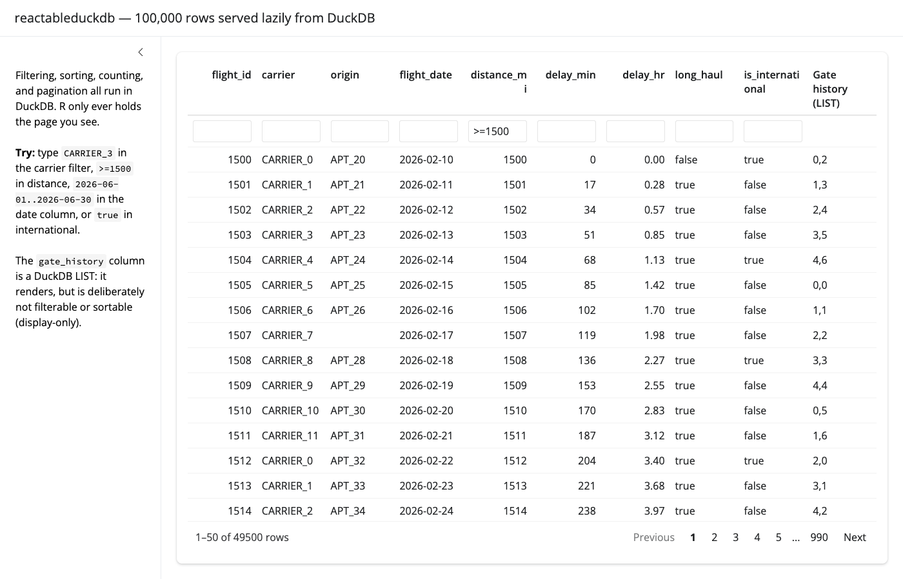

# reactableduckdb

<!-- badges: start -->

[](https://lifecycle.r-lib.org/articles/stages.html#experimental)
<!-- badges: end -->

reactableduckdb streams a lazy DuckDB query — a
[duckplyr](https://duckplyr.tidyverse.org) data frame or a
[dbplyr](https://dbplyr.tidyverse.org) lazy table — into a
[reactable](https://glin.github.io/reactable/) widget through
reactable’s server-side data backend API. **DuckDB does all filtering,
counting, sorting, and pagination**; R only ever materializes a zero-row
schema prototype, a scalar filtered count, and the requested page of
rows.

Unsupported behaviour errors loudly instead of silently falling back to
eager execution.

## Installation

reactableduckdb requires the **development version of reactable (\>=
0.4.5.9000)** — the CRAN release does not export the custom server
backend API (`reactableServerInit()`, `reactableServerData()`,
`resolvedData()`). Install it from GitHub:

``` r
pak::pak("glin/reactable")
# or: remotes::install_github("glin/reactable")
```

If you work behind a **Posit Package Manager** instance that mirrors that
GitHub repository, that route works equally well and needs no GitHub
access:

``` r
install.packages("reactable", repos = "<your Posit Package Manager URL>")
```

Either route is fine — reactableduckdb declares no `Remotes`, so it does
not force one on you. If the installed reactable turns out to lack the
backend API, the package warns once (naming both routes) rather than
refusing to load.

## Usage

``` r
library(reactableduckdb)

# The app owns its pins + pipeline. Note summarise(.by = ) — group_by()
# is refused under prudence = "stingy".
pin_path <- pins::pin_download(board, "example-data")
source_data <- duckplyr::read_parquet_duckdb(pin_path, prudence = "stingy") |>
  dplyr::filter(distance_mi > 0) |>
  dplyr::mutate(delay_hr = delay_min / 60)

backend <- reactable_duckdb_backend(source_data, key = "flight_id")

# In a Shiny server:
output$flights <- reactable::renderReactable(
  reactable_duckdb(backend, filterable = TRUE, defaultPageSize = 50L)
)
```

A complete self-contained example app (temporary pins board, synthetic
Parquet, lazy duckplyr pipeline) ships with the package:

``` r
shiny::runApp(system.file("examples", package = "reactableduckdb"))
```

<figure>

<figcaption aria-hidden="true">The example app serving 100,000 rows: the
numeric range filter <code>&gt;=1500</code> is applied to
<code>distance_mi</code>, DuckDB reports 49,500 matching rows paginated
across 990 pages, and the LIST-typed <code>gate_history</code> column is
display-only (no filter box). Screenshot is manually captured and may
lag the current UI; see the header of <code>inst/examples/app.R</code>
to regenerate.</figcaption>
</figure>

## What it never does

- collect the complete source into R (the only materializations are the
  prototype, a scalar count, and one page);
- silently clamp, ignore, or approximate a request it cannot honour —
  unknown filter/sort columns, display-only columns, oversized pages,
  and unsupported reactable arguments all raise structured errors;
- create or refresh pins, own application transformations, reconnect, or
  disconnect a connection it does not own.

When a pin or source query changes, the application constructs a new
backend and re-renders — a live backend cannot detect the change.

Outside a Shiny session the widget renders empty (the zero-row
prototype): the server backend needs a live session to answer data
requests.

## Documentation

- `vignette("reactable-duckdb")` — architecture, filter grammar, refusal
  rules, cache and lifecycle semantics.
- `design/` (source repository only) — the observed upstream contract
  and design documents.
